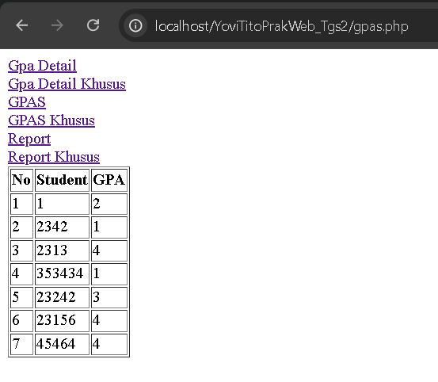

# TUGAS 2
## Deskripsi
Tugas ini dibuat sebagai penunjang nilai tugas 2 pada matakuliah Praktikum Pemrograman WEB Semester 2

Proyek ini mendemonstrasikan penerapan prinsip OOP dalam PHP, khususnya dalam interaksi dengan database MySQL. Konsep utama yang diterapkan meliputi enkapsulasi, inheritance, dan polimorfisme.

## TASK
#### 1. Membuat view berbasis OOP PHP dengan menerima data dari mySQL database (hanya mengambil tabel reports, gpas dan gpa_details).
#### 2. Menggunakan __construct sebagai link untuk terhubungan ke database.
```php
public function __construct(){
    $this->conn = mysqli_connect($this->host, $this->user, $this->pass, $this->db);
}
```
#### 3. Menerapkan encapsulation.
```php
class koneksi {
    private $host = "localhost";  
    private $user = "root";       
    private $pass = "";          
    private $db = "pweb2_oop_tugas_2"; 
    protected $conn;
}
```
#### 4. Menggunakan kelas turunan menggunakan inheritance.
```php
class Koneksi{
}

class Gpas extends Koneksi{
}

class GpasKhusus extends Gpas{
}
```
#### 5. Menggunakan polymorphiism
```php
class GpaDetail extends koneksi{
    public function ambilData(){
        $sql = "SELECT * FROM gpa_details";
        $data = mysqli_query($this->conn, $sql);
        while ($baris = mysqli_fetch_array($data)){
            $hasil[] = $baris;
        }
        return $hasil;
    }
}
class GpaDetail extends koneksi{
    public function ambilData(){
        $sql = "SELECT * FROM gpa_details WHERE semester_gpa = 1";
        $data = mysqli_query($this->conn, $sql);
        while ($baris = mysqli_fetch_array($data)){
            $hasil[] = $baris;
        }
        return $hasil;
    }
}

```

## Output Program
### 1. Tampilan tabel GPAS


### 2. Tampilan tabel GPAS yang memiliki comulative_gpa sama dengan 3

### 3. Tampilan tabel GPAS Detail

### 4. Tampilan tabel GPAS Detail yang memiliki semerter_gpa sama dengan 1

### 5. Tampilan tabel Report

### 6. Tampilan tabel Report dengan status bernilai Rejected


